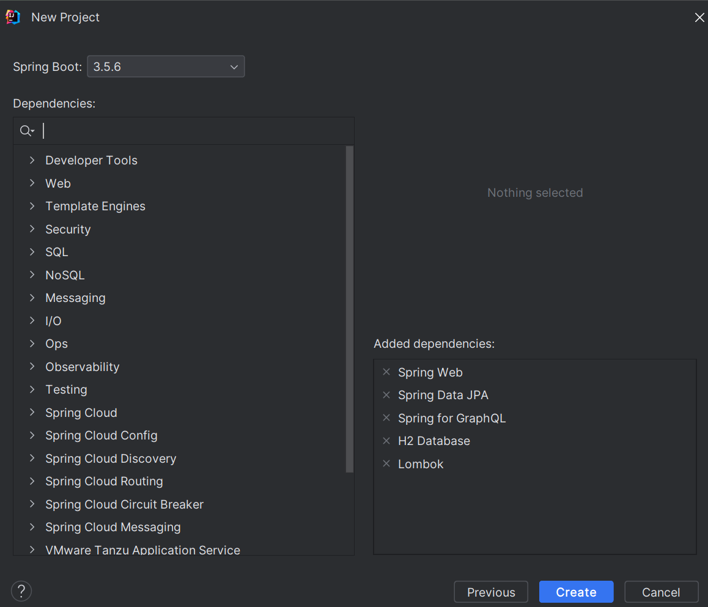
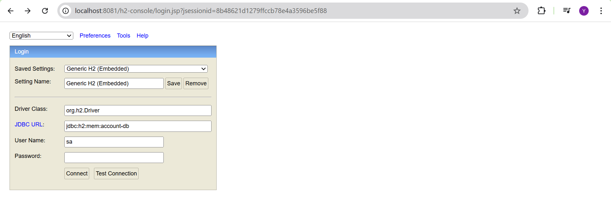
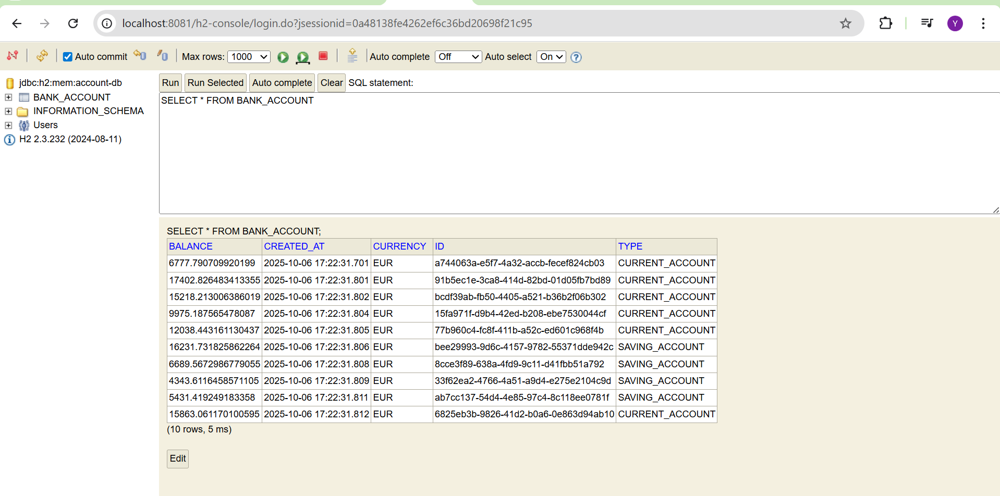
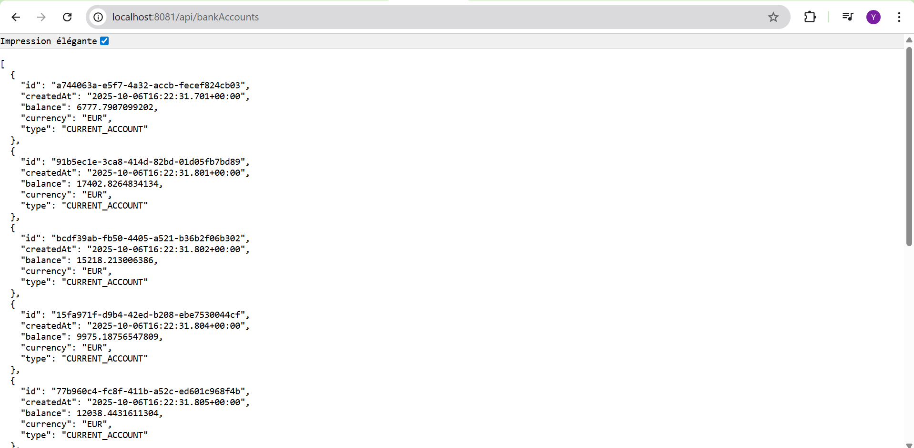
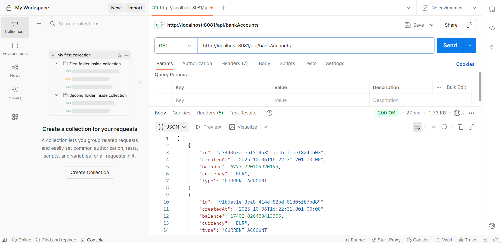
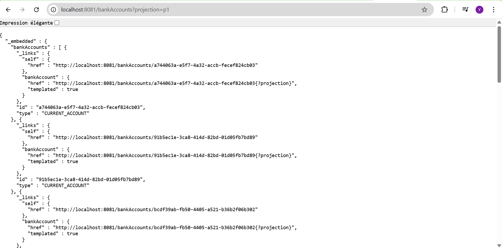
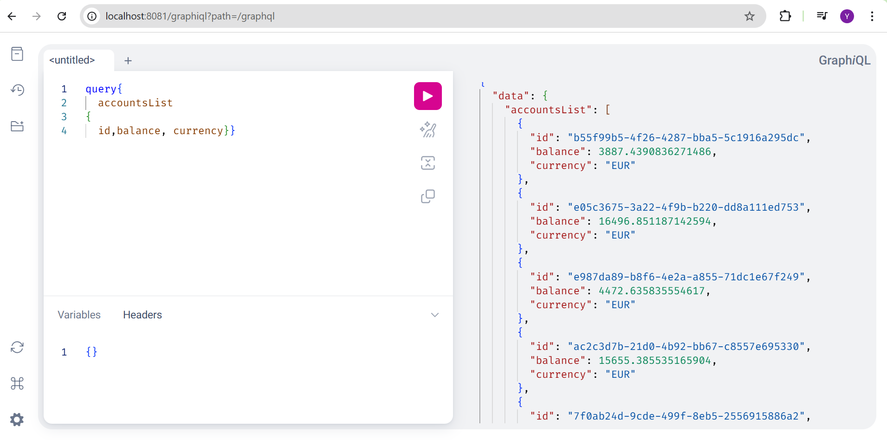
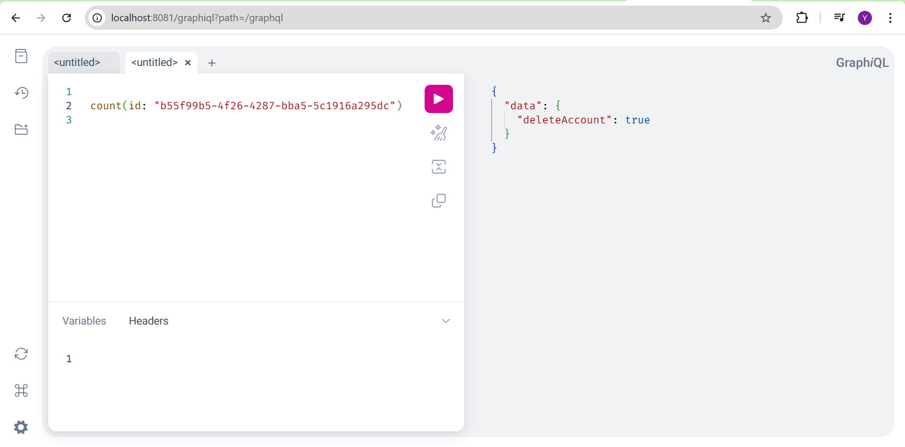
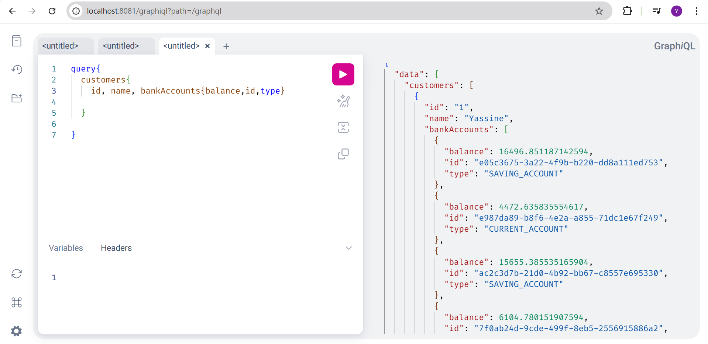

# Microservice de Gestion des Comptes Bancaires

Ce projet est un **microservice Spring Boot** permettant de gérer des **comptes bancaires** et leurs **clients**.  
Il expose des **services RESTful** et des **endpoints GraphQL** pour interagir avec les données.  
La base de données **H2 en mémoire** facilite le développement et les tests rapides.

## Table des Matières
- [Fonctionnalités](#fonctionnalités)
- [Technologies Utilisées](#technologies-utilisées)
- [Instructions d'Installation](#instructions-dinstallation)
- [Utilisation](#utilisation)
- [Endpoints de l'API](#endpoints-de-lapi)
- [Utilisation de GraphQL](#utilisation-de-graphql)

---

## Fonctionnalités
- Services web **RESTful** pour la gestion des comptes bancaires et des clients.
- Opérations **CRUD** complètes sur les comptes et les clients.
- Intégration de **GraphQL** pour des requêtes et mutations flexibles.
- Base de données **H2** en mémoire pour le développement et les tests.
- Utilisation de **projections JPA** pour limiter les champs retournés.

---

## Technologies Utilisées
- **Spring Boot**
- **Spring Data JPA**
- **H2 Database**
- **Lombok**
- **GraphQL**
- **Postman** (pour les tests des endpoints)

---

### 1. Créer un projet Spring Boot
Utilisez [start.spring.io](https://start.spring.io/) ou Intellij pour générer votre projet avec les dépendances suivantes :
- Spring Web
- Spring Data JPA
- H2 Database
- Lombok
- GraphQL  

### 2. Exécution de l'application
Lancez l'application, puis accédez à la console **H2** à l’adresse :  
👉 `http://localhost:8081/h2-console`

Indiquez le nom de la base défini dans le fichier `application.properties`.

## Utilisation

### 🔹 Endpoints RESTful
- **GET** tous les comptes :  
  `http://localhost:8081/v3/api-docs`  

  

  

Vous pouvez tester ces endpoints via **Postman**.

---
### Projection
Les **projections JPA** permettent d’afficher uniquement certains attributs.  
Exemple :  
`http://localhost:8081/bankAccounts?projection=p1`  
→ Affiche uniquement `id` et `type`.

## Utilisation de GraphQL
1. Ouvrez l’interface **GraphiQL** :  
   👉 `http://localhost:8081/graphiql`
2. Testez vos **requêtes** et **mutations** pour interagir avec les comptes et les clients.

Exemples :  
  
  

